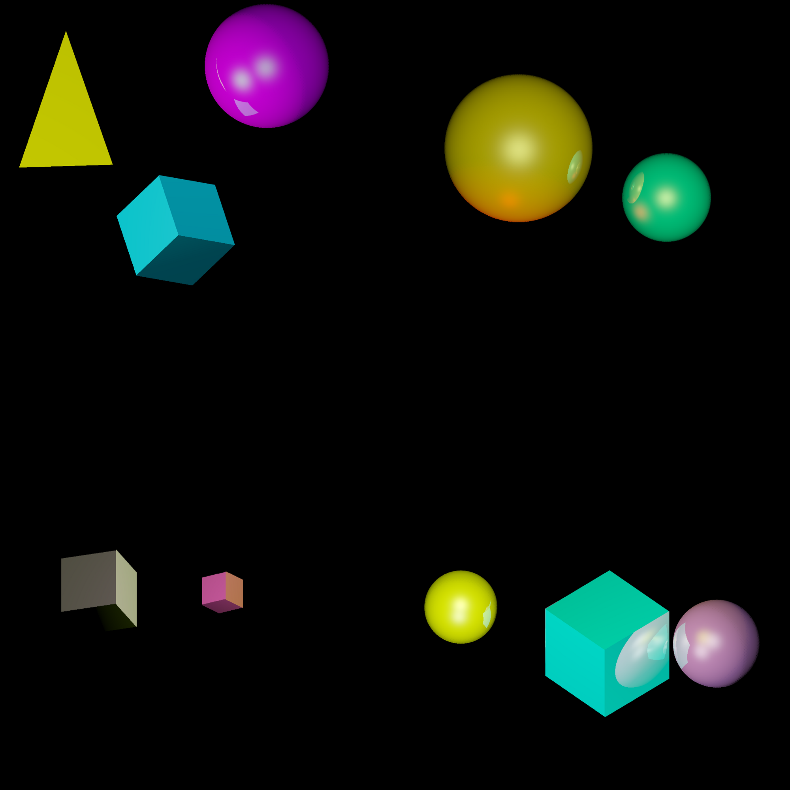

# IN204 - IT Project w/ Axel Dumont - RayTracer

<div style="text-align: center;">
  
</div>

## Résumé

Ce projet effectue un RayTracing sur un environnement composé de **sphères** et de **cubes**.

 - L'ensemble du code se trouve dans le dossier _src_.

 - Les scènes (objets, matériaux des objets, lumières) sont au format.txt et sont dans le dossier _scenes_.
 
 - Les images résultantes s'affichent en .png dans le dossier _images_.


## Compilation

### Packages nécessaires

Ces 3 packages sont nécessaires à la compilation :
​
```bash
sudo apt install graphicsmagick-imagemagick-compat
sudo apt install eog
sudo apt install bc
```
Pour ne pas avoir de warning en utilisant le package eog, il faut installer ce package:

```bash
sudo apt install adwaita-icon-theme-full
```
Pour synchroniser vos horloges et ne pas avoir de warnings lors de l'éxécuction du Makefile, il faut taper la commande :

```bash
sudo hwclock -s
```

Si hwclock n'est pas reconnu, il faut install utils-linux : `sudo apt install util-linux`

Enfin, avant de lancer le programme, n'hésitez pas à faire un petit `sudo apt-get upgrade`.
### Ligne de commande

Pour compiler le projet, il faut taper la commande `make all`. 

Pour nettoyer les fichiers images et l'éxécutable, il faut utiliser `make clean`.

Il est également possible de générer seulement une certaine image. Pour l'image 1 par exemple, il y a la commande `make image1`.

Pour générer l'image "scénique" de couverture, il faut utiliser la commande `make scene`.

## Description du système de scène 
​ 
Les scènes sont définies en **.txt** selon le format suivant :

*  _taille de l'image : Longeur Hauteur_ 
* _nombre de matériaux, nombre d'objets, nombre de lumières_
* _premier matériau: pourcentage RGB de diffusion- coefficient de reflexion - pourcentage RGB spéculaire - coef spéculaire_
* _deuxieme materiel s'il existe_
* _troisieme materiel s'il existe et etc..._ 
* _objet 1: posx, posy, posz, rayon (ou taille des côtés pour un cube), id du matériel (selon leur ordre dans le .txt), type de l'objet (cube ou sphère) angle_rot_x, angle_rot_y (à mettre en degrés)
*  _objet 2_ s'il existe
* _objet 3_ s'il existe et etc...
* _lumière 1 : posx, posy, posz, intensité rouge, vert et bleu_
* _lumière 2 si elle existe_

### Exemple de la première scène :
​
**scene1.txt :**
```txt
640 480 
3 3 2
1.0 1.0 0.0 0.2 1.0 1.0 1.0 60
0.0 1.0 1.0 0.3 0.4 0.8 1.0 30
1.0 0.0 1.0 0.5 0.0 1.0 0.0 100
233.0 290.0 0.0 70 0 cube 12 50
407.0 290.0 0.0 90 1 sphere 0 0
320.0 140.0 0.0 60 2 sphere 0 0
0.0 240.0 -100.0 1.0 1.0 1.0
640.0 240.0 -10000.0 0.6 0.7 1.0
```

## Fonctionnement de l'algorithme

1. Nous commencons par lire le fichier texte et placer les informations de la scène dans 3 listes (fonction `init()` de _main.cpp_ ) :
    - Les informations de chaque matériau sont dans la matrice _matTab_ : **matTab[i]** contient les infos sur le matériau d'indice _i_.
    - Les informations de chaque objet sont dans la matrice _objTab_ : **objTab[i]** contient les infos sur l'objet d'indice _i_.
    - Les informations de chaque lumière sont dans la matrice _lgtTab_ : **lgtTab[i]** contient les infos sur la lumière d'indice _i_.

2. On construit une image au format **TGA** (fonction `header_tga()` de _tga_image.hpp_ ) :
    - Les premiers octets de du fichier sont écrits de facon bien spécifique pour que le fichier soit considéré comme un .tga.
    - Ensuite, chaque groupe de 3 octets décrit les valeurs RBG d'un pixel.
    - Les pixels sont coloriés **ligne par ligne, de gauche à droite, en partant de la ligne du bas**.
    - Dans notre algorithme, on parcourt donc pour chaque y, tous les x, en partant de (x,y) = (0,0) (_lignes 28-29 de raytracer.cpp_)

3. Pour "parcourir" les pixels, voici comment on procède. Pour chaque pixel de coordonnées (x,y), on envoie un rayon horizontal d'origine (x,y) partant d'un z à l'infini. 
    - Si ce rayon touche un objet, alors on note le pixel (x,y) comme faisant partie de l'objet de plus proche que le rayon a traversé.
    - Pour tester l'intersection rayon-objet, on utilise les fonctions `hitSphere()` et `hitCube()` décrites dans _objects.hpp_.
    - Selon le type d'objet trouvé, on calcule le vecteur normal à la surface dont le pixel actuel fait partie. On calcule aussi le point d'intersection rayon-objet par la même occasion.

4. Pour "enfin" faire du RayTracing, voici la méthode (_cf. à partir de la ligne 90 de raytracer.cpp_) :
    - Pour chaque lumière :
        - Depuis chaque point d'intersection, on crée un rayon allant du point à la lumière.
        - Si ce rayon touche un objet : Le point est dans l'ombre de la lumière. On ne fait rien et on passe à la lumière suivante
        - Sinon, on calcule les valeurs RGB du pixel avec la méthode de Lambert.
        - On met ensuite à jour le rayon en utilisant les principes de la reflection, et on recommence.
        - On s'arrete quand notre coefficient de reflection devient trop faible, ou quand on a atteint le max d'itérations (noté _level_).

5. On a enfin fait des modifications d'exposition et une tranformation gamma pour augmenter la qualité des images.

Mais on a surtout appliqué de l'**antialiasing** : 

L'antialiasing est un méthode pour atténuer les transitions entre les formes et la scène derriere. Pour effectuer cela, dans le code ```raytrace.cpp```, on forme finalement une image de taille ```2x*2y``` (par exemple pour du 4x-antialiasing). Par la suite la couleur du pixel de sortie dans l'imatge finale est une moyenne des quatres pixels formés dans l'image agrandie.
